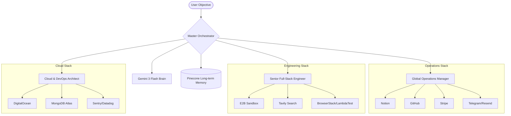

# Omni-Dev: The Autonomous Hyper-Agent Swarm 🚀


## 🌟 The Vision
**Omni-Dev** is an "expert-grade" autonomous agentic system designed to orchestrate complex software engineering, DevOps, and project management tasks. It leverages a hierarchical swarm of specialized agents powered by **Gemini 3 Flash Preview** and integrates **35+ industry-leading tools** from the GitHub Student Developer Pack and beyond.

## 🧠 System Architecture



## 🛠️ The Tech Stack

| Category | Tools |
| :--- | :--- |
| **LLM Engine** | Gemini 3 Flash Preview |
| **Observability** | Langfuse |
| **Logic** | TypeScript (Node.js) |
| **Frontend** | React, Tailwind CSS, Framer Motion, GSAP |
| **Cloud** | DigitalOcean, Google Cloud Run |
| **Database** | MongoDB Atlas, Pinecone, Appwrite |
| **Ops** | Notion, GitHub, Stripe, Namecheap |

## 🚀 Getting Started

### Prerequisites
- Node.js v18+
- API keys for integrated services (see `.env.example`)

### Installation
1. Clone the repository:
   ```bash
   git clone https://github.com/aniruddhaadak80/omni-dev.git
   cd omni-dev
   ```
2. Install core dependencies:
   ```bash
   npm install
   ```
3. Initialize the dashboard:
   ```bash
   cd omni-dashboard
   npm install
   ```

### Running the Swarm
To start the autonomous CLI interface:
```bash
npm start
```
To run the Hyper-UI Dashboard:
```bash
cd omni-dashboard
npm run dev
```

## 🎯 Features
- **Autonomous Tool Calling:** Self-selects from 35+ tools to achieve goals.
- **Hierarchical Reasoning:** Problems are broken down into Ops, Eng, and Arch domains.
- **Vectorized Memory:** Learns from past missions to improve future performance.
- **Micro-Animations:** A world-class editorial dashboard experience.
- **Live Dashboard:** [omni-dev-dashboard.vercel.app](https://omni-dev-dashboard.vercel.app)

---
Built with ❤️ by Antigravity for the 2026 Developer Pack Showcase.
